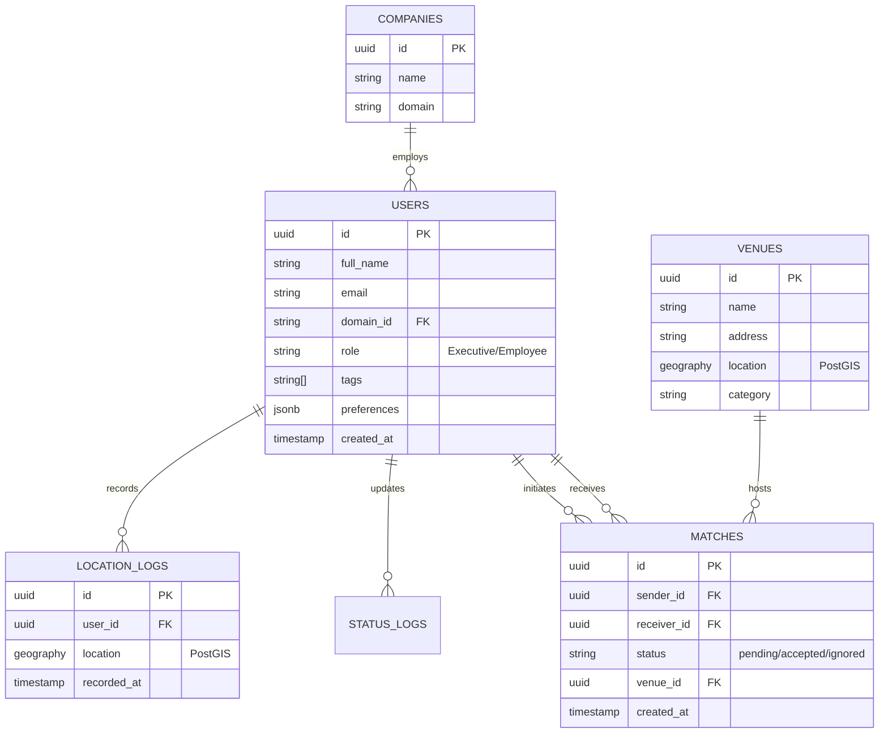

# データベース設計

## 1. 目的
本ドキュメントは、CrossBarにおけるデータ構造、テーブル定義、およびリレーションシップを定義する。位置情報処理のために PostGIS 拡張を前提とする。

## 2. ER図

## 3. テーブル定義

### 3.1 `companies` テーブル
企業の基本情報を管理する。
| カラム名 | 型 | 制約 | 説明 |
| :--- | :--- | :--- | :--- |
| `id` | uuid | PK, default_gen() | 企業ID |
| `name` | varchar | NOT NULL | 企業名 |
| `domain` | varchar | NOT NULL, UNIQUE | 企業ドメイン名（例: example.com） |

### 3.2 `users` テーブル
ユーザープロファイル。Clerkの `user_id` と紐付ける。
| カラム名 | 型 | 制約 | 説明 |
| :--- | :--- | :--- | :--- |
| `id` | uuid | PK, default_gen() | ユーザーID (Clerk ID) |
| `full_name` | varchar | NOT NULL | 氏名 |
| `email` | varchar | NOT NULL, UNIQUE | メールアドレス |
| `company_id` | uuid | FK(companies.id) | 所属企業ID |
| `role` | varchar | CHECK (role IN ('Executive', 'Employee')) | 役職カテゴリ |
| `tags` | text[] | | 興味・関心タグ |
| `preferences` | jsonb | | 通知設定、表示設定など |

### 3.3 `location_logs` テーブル
最新の位置情報を保持する（インデックス性能のため、最新のみ保持を推奨）。
| カラム名 | 型 | 制約 | 説明 |
| :--- | :--- | :--- | :--- |
| `id` | uuid | PK | ログID |
| `user_id` | uuid | FK(users.id), UNIQUE | ユーザーID |
| `location` | geography(POINT, 4326) | NOT NULL | PostGIS地理空間座標 |
| `recorded_at` | timestamp | NOT NULL, default(now()) | 記録日時 |

### 3.4 `matches` テーブル
オファー（乾杯、相談、おごり）の状態を管理する。
| カラム名 | 型 | 制約 | 説明 |
| :--- | :--- | :--- | :--- |
| `id` | uuid | PK | マッチID |
| `sender_id` | uuid | FK(users.id) | 送信者ID |
| `receiver_id` | uuid | FK(users.id) | 受信者ID |
| `status` | varchar | default('pending') | 状態(pending/accepted/ignored) |
| `venue_id` | uuid | FK(venues.id) | 提案された店舗ID |
| `created_at` | timestamp | default(now()) | 送信日時 |

## 4. 特記事項
- **PostGISの使用**: 地理空間検索（周囲Xメートルのユーザー検索）のため、`ST_DWithin` 等の関数を多用する。
- **データ削除ポリシー**: `location_logs` は最新の1件以外は定期的に物理削除し、プライバシーとパフォーマンスを維持する。
- **Rls (Row Level Security)**: SupabaseのRLS機能を用い、自分の位置情報は本人のみ、他人の位置情報は Visibility Matrix を通した結果のみ取得可能にする。

