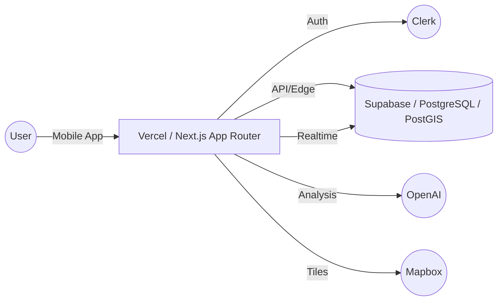
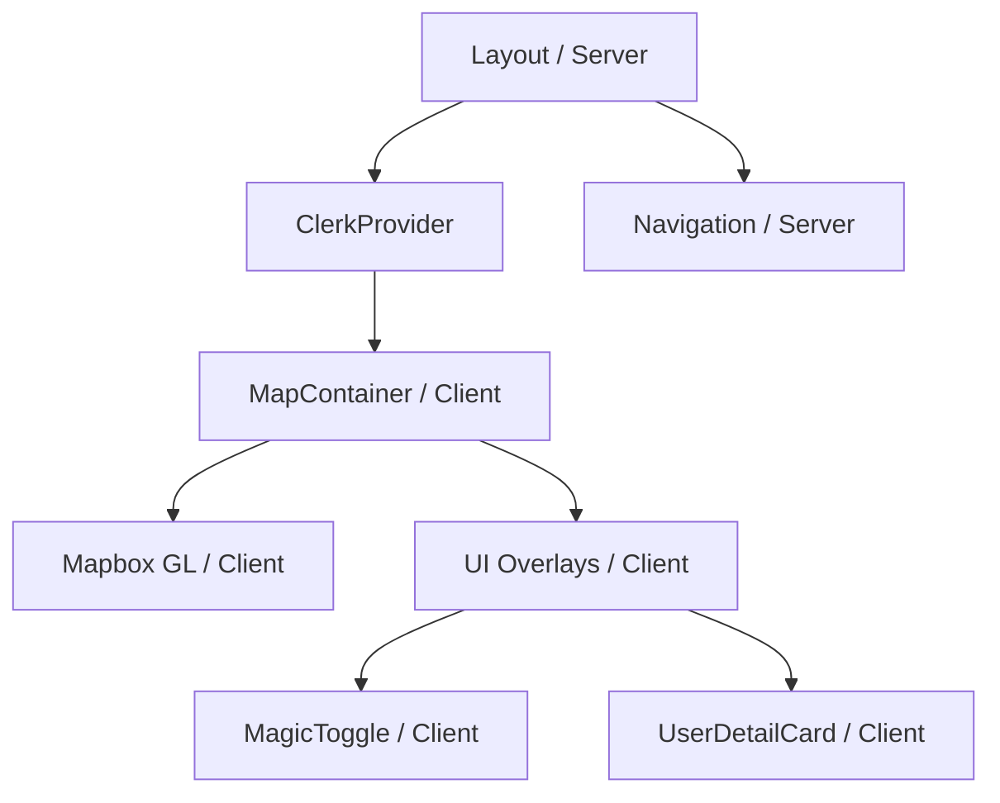

# システムアーキテクチャ設計

## 1. 目的
本ドキュメントは、CrossBarシステムの全体構成、技術スタック、およびコンポーネント間の連携を定義することを目的とする。

## 2. 技術スタック
| カテゴリ | 選定技術 | 選定理由 |
| :--- | :--- | :--- |
| **フロントエンド** | React Native (Expo) / Next.js (PWA) | 高頻度の位置情報取得、OS標準通知の利用、および開発効率の最大化。 |
| **言語** | TypeScript | 型安全性による実行時エラーの防止と保守性の向上。 |
| **バックエンド** | Next.js App Router (Vercel) | Edge Functionsによる低レイテンシ処理と、フロントエンドとの親和性。 |
| **データベース** | Supabase (PostgreSQL + PostGIS) | 地理空間データの高度な処理と、リアルタイム通信機能の標準提供。 |
| **認証** | Clerk | 企業ドメイン認証の容易な実装と高度なセッション管理。 |
| **AI** | OpenAI API (GPT-4o) | 属性やコンテキストに基づいた高度なマッチング推薦ロジックの構築。 |
| **地図基盤** | Mapbox | カスタムスタイル（Dark & Neon）の柔軟性とモバイルでの描画性能。 |

## 3. アーキテクチャ概要図

### 各コンポーネントの役割
- **Vercel / Next.js**: APIサーバーおよびフロントエンドのホスティング。Edge Functionsを用いて位置情報の曖昧化（Visibility Matrix）を高速に処理。
- **Clerk**: ユーザー認証および企業ドメインに基づく認可。
- **Supabase**: メインデータストア。PostGISを用いて地理空間検索を行い、Realtime機能でマッチング通知を即時配信。
- **OpenAI**: ユーザーの行動ログやタグを分析し、Smart Spotlightの推奨対象を決定。
- **Mapbox**: ネオンスタイルの地図描画と、ユーザーピンのレンダリング。

## 4. コンポーネント設計
### コンポーネント階層図

### 主要コンポーネント定義
1. **MapContainer (Client Component)**
   - **役割**: マップ全体の管理、位置情報の購読、Mapboxの制御。
   - **状態管理**: `useState` (現在地, 周辺ユーザーリスト), `useContext` (ユーザー設定)。
   - **Props**: なし（Rootレベルで使用）。

2. **MagicToggle (Client Component)**
   - **役割**: 4段階のステータス（Open/Listen/Biz/Ghost）の切り替えUI。
   - **Props**: `currentStatus: string`, `onStatusChange: (status: string) => void`.
   - **状態管理**: 内部でアニメーション状態を保持。

3. **UserDetailCard (Client Component)**
   - **役割**: マップ上のピンをタップした際に表示される詳細情報カード。
   - **Props**: `user: UserData`, `isRecommended: boolean`, `onOffer: (type: string) => void`.
   - **Server/Client**: サーバー側で取得した `UserData` を受け取り、クライアント側でインタラクション（オファー送信）を処理。

