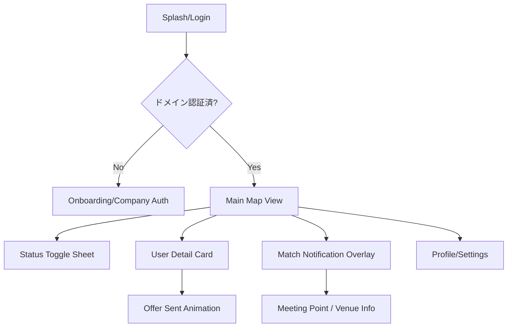

# UI/UX設計設計

## 1. デザインシステム
### デザインコンセプト
**"Night-Life Neon"** - 夜の街の賑わいと、プロフェッショナルな洗練をネオンカラーで表現。

### カラーパレット
- **背景**: `#0F172A` (Deep Slate) - 没入感のある夜の闇。
- **スポットライト**: `#2DD4BF` (Teal) - AI推奨ユーザーを強調。
- **チケット/警告**: `#E879F9` (Neon Pink) - 注目すべきアクション。
- **アクセント/金**: `#FCD34D` (Amber) - プレミアム感、エグゼクティブ感。
- **テキスト**: `#F8FAFC` (White/Silver) - 高い視認性。

### タイポグラフィ
- **フォント**: `Inter` (UI), `SF Pro Display` (Heading)。
- **スタイル**: 太字を多用し、ネオンの光を強調するグローエフェクトを重要要素に適用。

## 2. 画面一覧と遷移図
### 画面一覧
1. **ログイン/オンボーディング**: 企業メール認証、初期設定。
2. **メインマップ画面**: 中心機能。周辺ユーザーと自分のステータス表示。
3. **ステータス切替シート**: マジック・トグルの操作。
4. **ユーザー詳細カード**: 相手の情報閲覧、オファー送信。
5. **マッチ成立画面**: 合流場所の表示、成功演出。
6. **設定/プロフィール**: タグ編集、ボスブロック管理。

### 画面遷移図

## 3. 主要画面詳細
### 3.1 メインマップ画面
- **レイアウト**: 全画面 Mapbox 地図。
- **UI要素**:
  - **Floating Status Button**: 画面下部中央。現在のステータスを表示し、タップでシート展開。
  - **Spotlight Pins**: AI推奨ユーザーは通常のピンより大きく、周囲に波紋状のネオンアニメーション。
  - **Contextual Tags**: ピンの近くに `#M&A` 等のタグを小さくフローティング表示。

### 3.2 マジック・トグル（ステータス切替シート）
- **インタラクション**: 下部からハーフモーダルで展開。
- **要素**:
  - 4つの大きなアイコンボタン。
  - 各ボタン選択時に、自分のピンからその色のオーラが広がる演出。
  - **Ghostモード**選択時は、地図全体にノイズが走るような視覚効果で「非表示」を表現。

### 3.3 ユーザー詳細カード
- **レイアウト**: カード形式のポップアップ。
- **要素**:
  - 抽象化された肩書き、共通の興味タグ。
  - AIによる一言コメント（「今夜は経営戦略の話で盛り上がれそうです」等）。
  - **Large Action Buttons**: 
    - `Cheers!` (Teal)
    - `Ticket` (Amber, エグゼクティブのみ)
    - `SOS` (Pink, 社員のみ)

