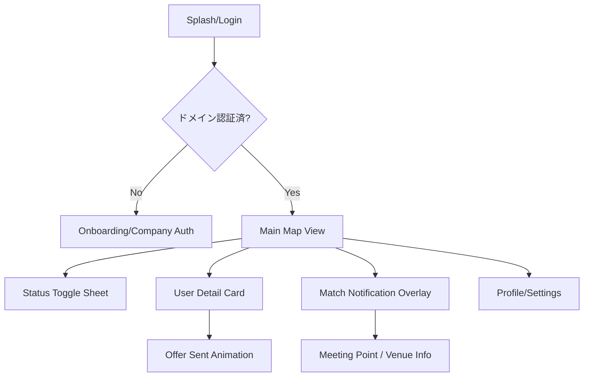
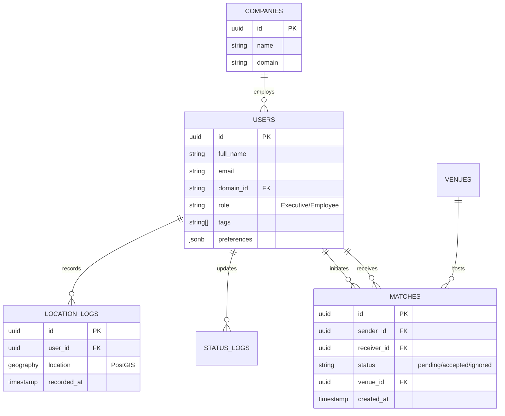
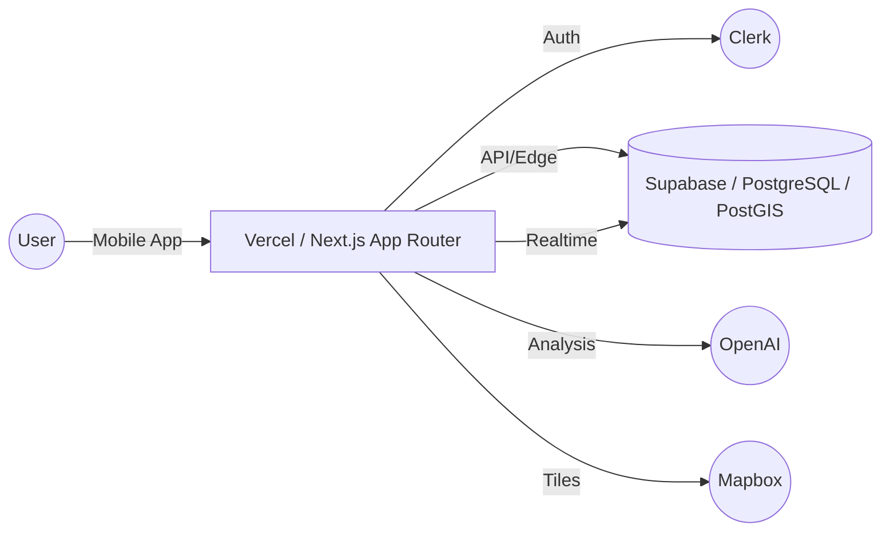
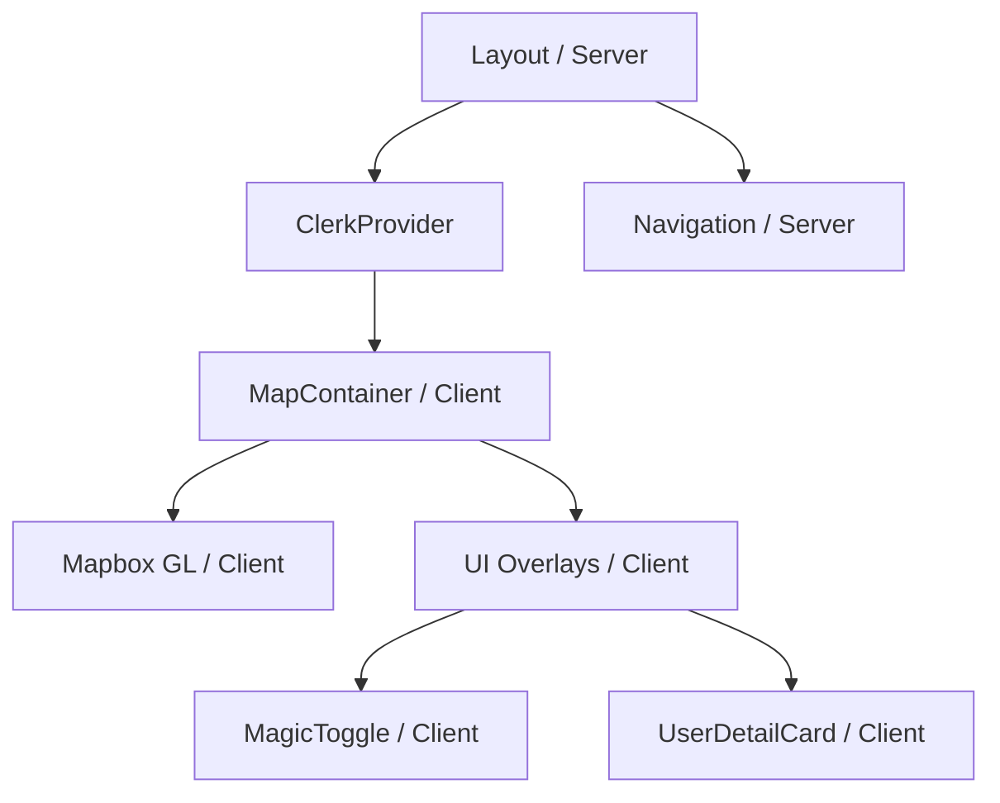

# 詳細要件定義書：CrossBar

## 1. プロジェクト概要
本プロジェクト「CrossBar」は、経営者および企業の従業員を対象とした、位置情報活用型のナイトタイム・ビジネスマッチングプラットフォームです。
Afterコロナにおける対面交流の価値再認識と、LLM普及による「誘うための言語化コスト」の増大という背景から、**「テキスト入力ゼロ（Zero-Text）」**のUXをコアコンセプトに据えています。AIによる「Smart Spotlight」と動的なプライバシー制御「Visibility Matrix」により、心理的・物理的ハードルを極限まで下げた偶発的なマッチングを実現します。

## 2. ビジネス要件
### 2.1 リーンキャンバス要約
- **課題**: 会食後の質の高い交流の欠如、組織の縦割り（サイロ化）、若手の離職。
- **解決策**: 位置情報マップ、AI推奨（Spotlight）、ワンタップ・オファー。
- **主要指標 (KPI)**: MAU（夜間ログイン率）、マッチング成立数（社外/社内タテ/社内ヨコ）、組織活性スコア。
- **独自の価値提案**: 言語化ストレスなしで、今近くにいる最適な相手と合流できる体験。
- **収益構造**: 法人SaaS（メイン）、個人エグゼクティブ会費、店舗送客手数料。

### 2.2 KGI/KPI
- **KGI**: 有料法人契約数および従業員継続利用率の向上。
- **KPI**:
  - 週次マッチング成立件数（1ユーザーあたり0.5回以上を目標）。
  - 「SOS（相談）」および「Ticket（おごり）」機能の利用率。
  - 提携店舗への誘導数（月間100件以上/1店舗あたり）。

## 3. ユーザー要件
### 3.1 ペルソナ
#### ペルソナ1：佐藤健治 (45歳) - 経営者
- **属性**: IT系スタートアップ代表、港区在住。
- **状況**: 会食が多く、21時以降に「もう一軒行きたいが、わざわざ誰かを誘うのは面倒。でも質の低いバーには行きたくない」と考えている。
- **ニーズ**: 同じ視座を持つ経営者との偶発的な対話、または自社の若手の本音を聞く機会。

#### ペルソナ2：田中美咲 (26歳) - 若手社員
- **属性**: 大手企業の営業、入社3年目。
- **状況**: キャリアに悩んでいるが、上司を畏まって誘うのは心理的ハードルが高い。他部署にどんな人がいるか知らない。
- **ニーズ**: 気軽に「おごり」で上司の話を聞きたい、同期や他部署と繋がりたい。

### 3.2 ユーザーストーリー
1. 経営者として、会食後にアプリを開き、近くにいる「Open」状態の他社経営者をAIが光らせてくれるので、ワンタップで「乾杯」を送りたい。
2. 若手社員として、仕事帰りに「SOS」アイコンを出すことで、近くにいる「Listen」状態の役員にキャリア相談のきっかけを作りたい。
3. 同僚同士として、マップ上の「同僚準ピンポイント表示」を見て、偶然近くで飲んでいる同期に合流したい。
4. 人事担当者として、部署を跨いだ交流がどの程度起きているかを可視化し、組織の風通しを確認したい。

### 3.3 MVPの定義
- **範囲**: 特定の経営者コミュニティおよびその自社社員限定。
- **機能**: ステータス切り替え（4種）、マップ表示（曖昧化ロジック込）、ワンタップ・オファー（Cheersのみ）、Clerk認証。

## 4. 機能要件
### 4.1 機能一覧 (MoSCoW)
- **Must Have (🔴)**: 
  - マジック・トグル（ステータス管理）
  - 位置情報マップ（Mapbox）
  - Visibility Matrix（動的曖昧化）
  - ワンタップ・オファー（Cheers!）
  - Clerkによるドメイン認証
- **Should Have (🟡)**:
  - Smart Spotlight（AI推奨表示）
  - SOS / Ticket アイコン
  - ボスブロック（特定ユーザー非表示）
- **Nice to Have (🟢)**:
  - 提携店予約・決済連携
  - 組織活性化分析レポート
- **Won't Have (⚪)**:
  - フリーテキストチャット（コンセプト維持のため）

### 4.2 主要機能詳細仕様
#### 機能：Visibility Matrix (位置情報制御)
- **ユースケース**: ユーザーの関係性に応じて位置情報の精度を動的に変更する。
- **正常系フロー**:
  1. APIが周辺ユーザーの座標を取得。
  2. 視点ユーザーと対象ユーザーの関係性をDBで判定（自社/他社/役職）。
  3. `他社経営者` -> 半径500mの円内でランダムにずらして返却。
  4. `自社役員` -> エリア通知のみ（座標なし）。
  5. `自社同僚` -> 準ピンポイント（10-50m程度の誤差）。
- **例外系**: 対象が「Ghost」モードの場合は一切の情報を返さない。

#### 機能：Smart Spotlight (AI推奨)
- **ユースケース**: AIが相性の良い相手をマップ上で強調表示する。
- **正常系フロー**:
  1. バックグラウンドでOpenAI APIがユーザーのタグ（#M&A, #サウナ等）とマッチング履歴を分析。
  2. 条件に合致するユーザーに `is_recommended` フラグを付与。
  3. フロントエンド（Mapbox）で対象のピンにネオンサークルのアニメーションを付与。

## 5. UI/UX設計
### 5.1 デザインコンセプト
- **コンセプト**: **Night-Life Neon**
- **カラーパレット**: 
  - Background: `#0F172A` (Deep Slate)
  - Primary (Spotlight): `#2DD4BF` (Teal)
  - Secondary (Alert/Ticket): `#E879F9` (Neon Pink)
  - Accent: `#FCD34D` (Amber)
- **タイポグラフィ**: Inter または SF Pro (モダン・プロフェッショナル)

### 5.2 画面遷移図


### 5.3 主要画面ワイヤーフレーム
#### Main Map View
```
-----------------------------------------
| [Search/Tags]          [Profile Icon] |
|                                       |
|      ( ) Spotlighted User             |
|                                       |
|  ( ) Regular User        ( ) Peer     |
|                                       |
|                                       |
| [Status Toggle: 🍸 Open v]             |
-----------------------------------------
```

## 6. 非機能要件
- **パフォーマンス**: 
  - 位置情報更新からマップ反映まで5秒以内。
  - 表示ユーザー数は最大100名/画面に制限（描画負荷軽減）。
- **セキュリティ**: 
  - 位置情報は暗号化して保存。
  - 24時間以上経過した位置ログは物理削除。
- **スケーラビリティ**: 初期1,000人、最大10,000人の同時接続を想定。
- **可用性**: 21時〜26時の稼働率99.9%以上。

## 7. データベース設計
### 7.1 ER図


### 7.2 主要テーブル定義
- **users**: 基本情報、タグ、ロール。
- **location_logs**: PostGISを用いた地理空間情報（最新1件のみ保持）。
- **matches**: オファーの送受信状態、合流場所。

## 8. インテグレーション要件
- **Clerk**: 企業ドメイン認証、ソーシャルログイン、セッション管理。
- **OpenAI (GPT-4o)**: ユーザー属性に基づいたマッチング推薦文の生成、Spotlightロジック。
- **Mapbox SDK**: マップ描画、カスタムタイルスタイル、逆ジオコーディング。
- **Vercel Edge Functions**: 位置情報の曖昧化処理（低レイテンシ実行）。

## 9. 技術選定とアーキテクチャ
### 9.1 アーキテクチャ概要図


### 9.2 コンポーネント階層図


## 10. リスクと課題
- **技術的課題**: バックグラウンドでの位置情報取得によるバッテリー消費。
- **ビジネスリスク**: 監視社会への懸念（Visibility Matrixの徹底による緩和が必要）。
- **法的リスク**: ユーザー間のトラブル。匿名通報機能と法人ドメインによる身元保証で対応。

## 11. ランニング費用と運用方針
- **インフラ費用 (仮定)**: 
  - Supabase Pro Plan: $25/month + Usage
  - Clerk: Free tier or Pro (~$20/month)
  - OpenAI: 従量課金（マッチング計算頻度に依存）
  - Mapbox: 無料枠内（一定PV以上で課金）
- **運用方針**: 24時間監視は不要だが、夜間（21-26時）の障害検知アラートを設定。

## 12. 変更管理
- 開発フェーズ中の要件変更は GitHub Issues で管理。
- プロダクトオーナーの承認を経て Sprint に組み込む。

## 13. 参考資料
- [Next.js App Router Documentation](https://nextjs.org/docs)
- [Supabase PostGIS Guide](https://supabase.com/docs/guides/database/extensions/postgis)
- [Mapbox Mobile Maps SDK](https://docs.mapbox.com/mobile-maps-sdk/overview/)

